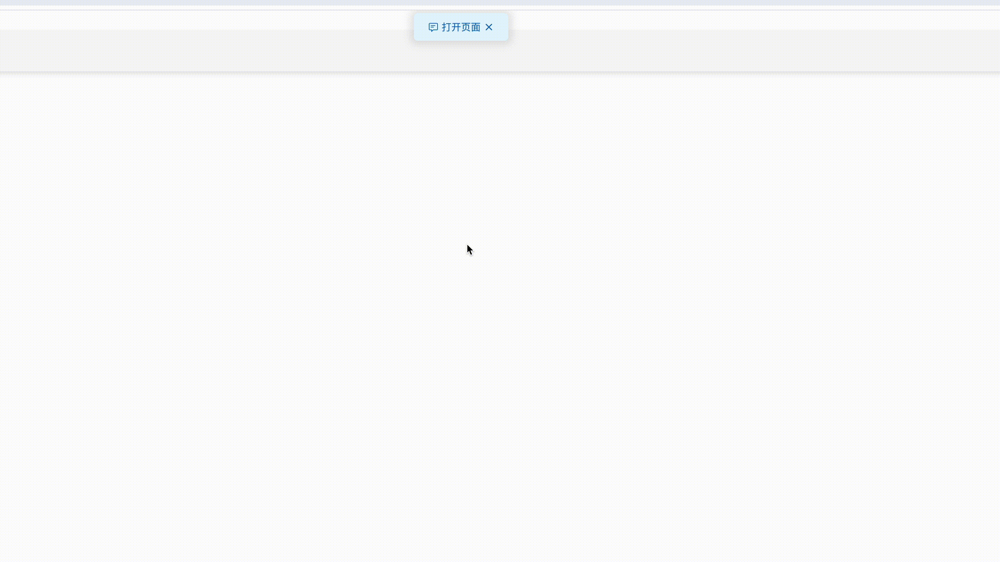

# mini-toast

使用方法

``` html
<script src="./autolog.js"></script>
<script>
        document.addEventListener('DOMContentLoaded', function () {
            autolog.warn('请勿在此页面输入任何敏感信息。');
            autolog.error('请勿在此页面输入任何敏感信息。');
            autolog.info('请勿在此页面输入任何敏感信息。');
            autolog.success('请勿在此页面输入任何敏感信息。');

            clicklog.warn('打开页面');
            clicklog.error('打开页面');
            clicklog.info('打开页面');
            clicklog.success('打开页面');
        });
</script>
```

demo


